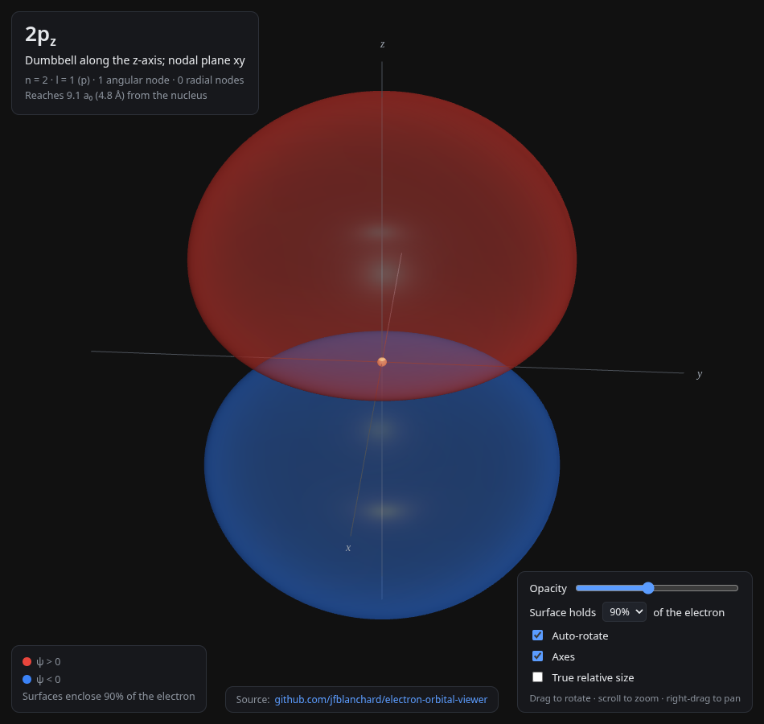
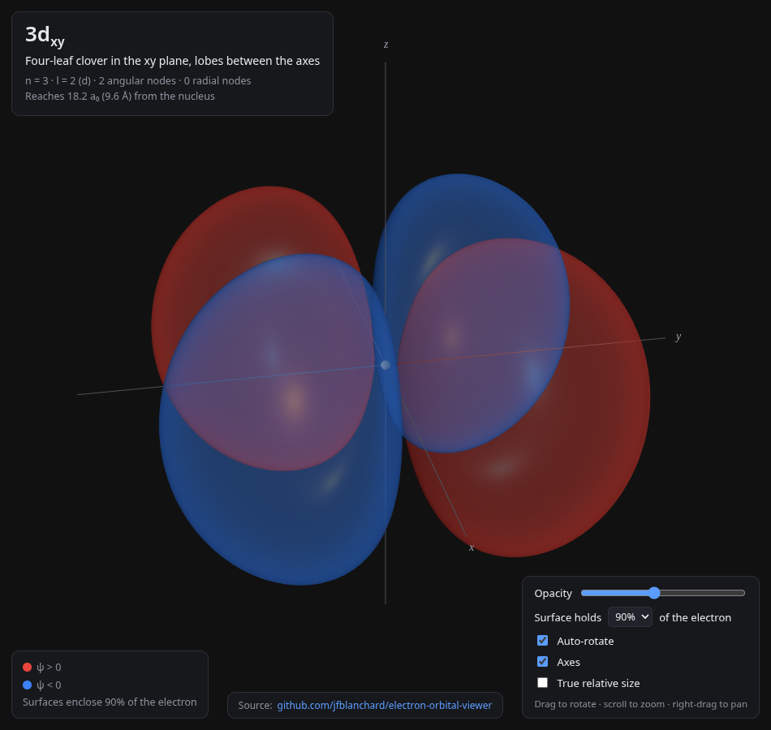
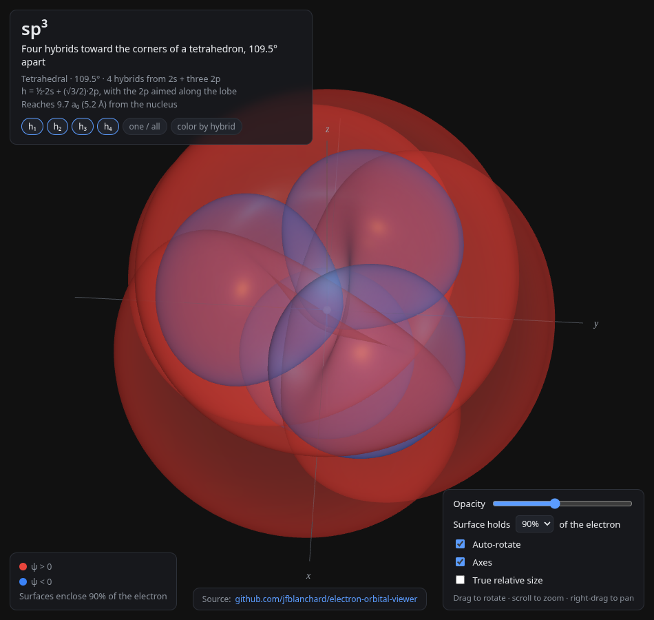

# Electron Orbital Viewer

An interactive, textbook-style 3D viewer for **electron orbitals** (atomic
orbitals and hybridization shapes) — built as a visual aid for quantum chemistry
and organic chemistry concepts (VSEPR, bonding, orbitals).

Semi-transparent probability-density isosurfaces, sign-colored lobes, and free
three.js rotation / zoom / pan let you explore the shape of the wavefunctions
directly, in a way a printed diagram can't.

## What's included

- **Atomic orbitals** — 1s–4s, 2p/3p, all five 3d, all seven 4f for hydrogen-like
  atoms (radial parts are hydrogenic; real spherical harmonics give the angular
  shapes).
- **Hybridization shapes** — sp, sp², sp³, sp³d, sp³d².
- **Customizable display** — surface contour (50–95%), opacity, auto-rotate,
  axes, and true relative size.
- **Physics-first math** — wavefunctions are normalized so ∫|ψ|² dV = 1, and
  surfaces enclose exactly the requested fraction of the electron; sign coloring
  follows the wavefunction phase.

## Screenshots

| 2p<sub>z</sub> | 3d<sub>xy</sub> | sp³ |
|:---:|:---:|:---:|
|  |  |  |

## Try it live

**<https://orbital-viewer.pages.dev>**

## Run locally

```bash
cd deploy
python3 -m http.server 8000
# open http://localhost:8000   (a server is required — ES modules + a Web Worker)
```

To deploy your own copy to Cloudflare Pages:

```bash
cd deploy
npx wrangler pages deploy . --project-name <your-project-name>
```

## Tests

```bash
node tests/test_orbitals.mjs
```

## Layout

```
deploy/   self-contained web app — the deploy unit (see deploy/README.md)
tests/    Node checks for the orbital math and surface meshes
assets/   README screenshots
```

## License / source

Source: <https://github.com/jfblanchard/electron-orbital-viewer>

MIT License (see LICENSE).